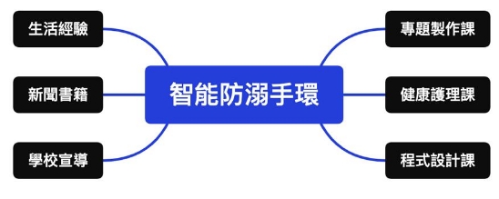
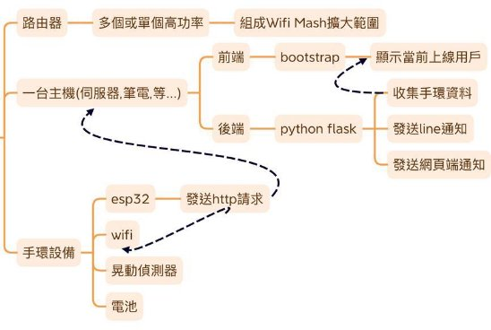
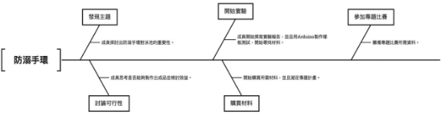
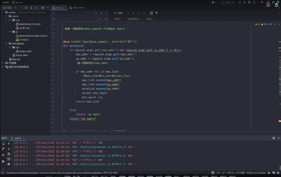
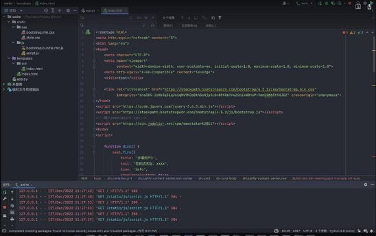
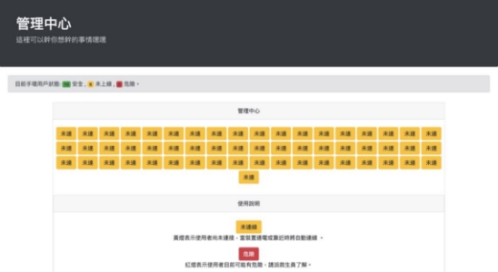
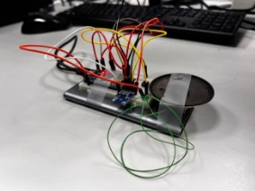

群     別：電機與電子群 作品名稱：智能防溺手環

關  鍵  詞：Wi-Fi 控制、防溺手環、水域安全

目錄** 

[壹、**  摘要................................................................................................... 1 ](#_page5_x87.00_y180.92)[貳、**  研究動機........................................................................................... 1 ](#_page5_x87.00_y729.92)[參、**  主題與課程之相關性或教學單元之說明 ...................................... 2 ](#_page6_x87.00_y459.92)

[一、  課程相關性....................................................................................... 2 ](#_page6_x87.00_y504.92)[二、  主題相關性....................................................................................... 3 ](#_page7_x87.00_y425.92)[肆、**  研究方法........................................................................................... 4 ](#_page8_x87.00_y108.92)[一、  軟硬體工具之選擇與探討 .............................................................. 4 ](#_page8_x87.00_y153.92)[（一）  硬體材料....................................................................................... 4 ](#_page8_x87.00_y198.92)[（二）  軟體應用....................................................................................... 5 ](#_page9_x87.00_y424.92)[二、  系統運作流程 .................................................................................. 7 ](#_page11_x87.00_y72.92)[三、  研發步驟........................................................................................... 7 ](#_page11_x87.00_y459.92)[伍、**  研究結果........................................................................................... 7 ](#_page11_x87.00_y684.92)[陸、**  討論................................................................................................... 9 ](#_page13_x87.00_y576.92)[一、  手錶元件採用 .................................................................................. 9 ](#_page13_x87.00_y621.92)[二、  手錶細節優點 ................................................................................10 ](#_page14_x87.00_y270.92)[三、  以網頁形式呈現之理由 ................................................................10 ](#_page14_x87.00_y468.92)

[柒、**  結論.................................................................................................10 ](#_page14_x87.00_y702.92)[一、 ...........................................................................................................10 ](#_page14_x87.00_y747.92)[捌、**  參考資料.........................................................................................11 ](#_page15_x87.00_y72.92)[一、  參考書籍.........................................................................................11 ](#_page15_x87.00_y117.92)[二、  網頁資料.........................................................................................11 ](#_page15_x87.00_y603.92)[三、  數據文獻.........................................................................................12 ](#_page16_x87.00_y441.92)[玖、**  附錄：作品分工表 ........................................................................13 ](#_page17_x87.00_y72.92)[壹拾、**  附錄：競賽日誌 ........................................................................14 ](#_page18_x87.00_y72.92)

[圖 1：主題相關性架構圖 ....................................................................... 4 ](#_page8_x87.00_y72.92)

[圖 2：EPS8266 開發板 ........................................................................... 4 ](#_page8_x221.00_y415.92)[圖 3：GY-61 ADXL335 感測器 ............................................................. 4 ](#_page8_x221.00_y595.92)[圖 4：HJ 752035 電池 ............................................................................ 5 ](#_page9_x221.00_y162.92)[圖 5：蜂鳴器 .......................................................................................... 5 ](#_page9_x221.00_y343.92)[圖 6：Flask ............................................................................................. 5 ](#_page9_x93.00_y605.92)[圖 7：Python ........................................................................................... 5 ](#_page9_x93.00_y732.92)[圖 8：Clion ............................................................................................. 6 ](#_page10_x93.00_y126.92)[圖 9：Post Man ....................................................................................... 6 ](#_page10_x93.00_y235.92)[圖 10：HTML、JS 與 CSS..................................................................... 6 ](#_page10_x93.00_y343.92)[圖 11：PlatformIO .................................................................................. 6 ](#_page10_x93.00_y470.92)[圖 12：系統運作流程圖 ......................................................................... 7 ](#_page11_x87.00_y414.92)

[圖 13：研發步驟示意圖 ......................................................................... 7 ](#_page11_x87.00_y639.92)

[圖 14：Python Flask 後端，研發程式介面............................................ 8 ](#_page12_x87.00_y351.92)

[圖 15：上圖為前端 HTML、JS 與 CSS 撰寫畫面 ................................ 8 ](#_page12_x87.00_y675.92)[圖 16：為前端成果畫面 ......................................................................... 9 ](#_page13_x87.00_y315.92)

[圖 17：實驗手環結構照 ......................................................................... 9 ](#_page13_x87.00_y531.92)

v 
表目錄** 

[表 1：課程相關性說明表 ....................................................................... 2 ](#_page6_x87.00_y549.92)[表 2：硬體材料表 .................................................................................. 4 ](#_page8_x87.00_y243.92)[表 3：軟體應用表 .................................................................................. 5 ](#_page9_x87.00_y469.92)[表 4：前後端使用技術簡介表 ............................................................... 6 ](#_page10_x87.00_y569.92)

vi 
全國高級中等學校專業群科 **112** 年專題實作與創意競賽

「專題組」作品說明書內頁

【智能防溺手環】

壹、摘要** 

1 
全國高級中等學校專業群科 **112** 年專題實作與創意競賽

「專題組」作品說明書內頁

`     `我們研發的智能手環具有多種的功能，包括「使用 「一對多監控」、「自動向警方求助」等。手環使用 時傳送資料給救生員，讓他們能夠及時展開救援。

wifi 通訊」、 wifi 通訊，能夠即

全國高級中等學校專業群科 **112** 年專題實作與創意競賽

「專題組」作品說明書內頁

`     `此外，手環還具有「一對多監控功能」，可以由主控台監控所有 手環，讓救生員能夠更有效地管理所有泳客的狀態。其次，手環還具 有「自動向警方求助」的功能。

`     `在發生危險時，手環會自動向警方發出求救訊號，以便警方能夠 及時派出救援人員。此外，手環還配有「持久電池」，能夠提供足夠的 電力，讓泳客在水中使用更加方便。

`     `另外，手環還具有「輕量化」的特點，讓泳客不會應為帶到手環 而感到不舒適。最後，手環可以「跨平台使用主流 IOS、Android 與 Windows」都可以監看畫面。並且，適用於各種場景，包括溪流、海 邊水域等。這使得手環在保護泳客安全方面更加強大。

貳、研究動機** 

2 

`     `根據統計數據，在水樂園、泳池等地，溺水事件的發生率相當高， 根據內政部統計近年的各級水域救援數據，平均每年約有 700  多人 溺水，死亡人數超過一半，其中又以發生地點為溪河的事故案件最多， 而且這個數字正在逐年增加。

`     `因此我們正在研發一款手環旨在監測人體狀態，以便在發生溺水 危險時能夠最快地發現並通知救生員。這讓我們深感憂慮，因此我們 希望能夠提早發現並救援可能發生溺水的泳客，以降低死亡的機率。

我們相信，這個智能手環有助於減少溺水事件，並讓泳池成為一個更 安全、更輕鬆愉快的地方。有助於台灣漸漸老人化的社會，對長者或 是小孩能有一定的保護作用。

參、主題與課程之相關性或教學單元之說明

一、課程相關性

表 1：課程相關性說明表

|課程名稱 |教學內容 |相關性說明|
| - | - | - |
|基本電學實習|瞭解基本電路有關電 子元件常識及運用。|了解在專題上要運用 什麼材料。|
|程式設計實習|撰寫 C 語言，邏輯運 算子，資料型態等。|撰寫 Arduino程式碼。|

4 

|專題製作 |專題文件與歷屆學長 作品學習與觀摩。|了解如何製作專題。|
| - | :- | - |
|
彈性課程 

（Arduino 實作） 
|操作 Arduino 燒錄， LED亮滅等程式碼基 本撰寫。 |學 習 如 何 操 作 Arduino 過程。 |
|
物件導向程式設計

(Python) 
|Python 撰寫，資料型 態，邏輯運算子等。|專題撰寫 Python程式 碼。 |
|
物件導向程式設計

(網頁) 
|HTML 撰寫，基本網 頁排版，CSS 撰寫。 |專題前端介面撰寫。|

二、主題相關性

`     `我們在學校例行的朝會中聽到了有關夏日戲水安全的議題，並在 健康護理課中學習到了關於游泳自救以及游泳危險因子的相關知識， 這些都引發了我們思考製作一個能夠提供戲水安全保護的專題。

圖 1：主題相關性架構圖

肆、研究方法** 

一、軟硬體工具之選擇與探討 （一）硬體材料 

表 2：硬體材料表

|名稱 |版本及型號|用途 |
| - | - | - |
|
mini  D1  wifi NodeMcu Lua WIFI

基於 ESP8266 
|

圖 2：EPS8266 開發板 
|智能手環核心。用於介接各 種介面並且內建藍芽和 wifi 模組，使得手環體積可 以 更 小 ， 價 格 相 較 於 Arduino 更低。 |
|
GY-61  ADXL335 三軸重力加速度角

度感測器 
|

圖 3：GY-61 ADXL335 感測 器 
|可以使用於測量傾斜檢測 應用中的靜態重力加速度， 以及運動、沖擊或振動導致 的動態加速度。用於偵測手 環使用者是否處在活動。|

|HJ  752035 ， 3.7V 400mAh 電池 |

圖 4：HJ 752035 電池 
|用於供給手環電力，可充電 放電，讓手環不用為了電力 而煩惱，隨處可用。採用 3.7V  400mAh ， 符 合 ESP8266 使用合適。|
| :- | - | - |
|蜂鳴器 |

圖 5：蜂鳴器 
|用於發出高分貝聲響以警 示用戶手部過久未晃動。並 且可以調成不同的音調。供 使用者客製化調整。|

（二）軟體應用 

表 3：軟體應用表

|軟體名稱 |用途 |
| - | - |
|

圖 6：Flask 
|基於 Python 的 Web 環境端，相較於傳統的 PHP 與 Nginx 環境下體積更小，更容易部署， 並且可以讓我們的軟體更好通訊。|
|

圖 7：Python 
|方便開發的程式語言，可以搭配 ESP32 進行 溝通，讓主控台顯示手環用戶目前狀況，回 傳相關資料等。|

|

圖 8：Clion 
|用於開發手環環境硬體端程式，主板採用 ESP8266，並且可以導入 Arduino 函式庫撰 寫，方便並且更容易維護。|
| - | - |
|

圖 9：Post Man 
|用於 HTTP 傳輸除錯的好工具，可以發送 POST 請求或是 GET 請求，更方便讓手環跟 網頁端進行連線。|
|

圖 10：HTML、JS

與 CSS 
|
用於設計主控端使用者介面，讓救生員及相 關工作人員能更好的監控使用者的狀況，並 且以有好的方式顯示。支援跨平台， Android 與 Windows 都可以使用。

IOS、
|
|

圖 11：PlatformIO 
|用於擴充 Clion支援開發板開發，讓 ESP8266 或 Arduino 可以支援 IDE，讓開發步驟方便 不少。 |

表 4：前後端使用技術簡介表

<table><tr><th colspan="1" rowspan="3" valign="top">技術使用簡覽</th><th colspan="1" valign="top">前端 </th><th colspan="1" valign="top">HTML、JS  、CSS </th></tr>
<tr><td colspan="1" valign="top">框架 </td><td colspan="1">BOOSTRAP 5 </td></tr>
<tr><td colspan="1" valign="top">後端 </td><td colspan="1" valign="top">Python、C、ESP8266 </td></tr>
</table>

二、系統運作流程

圖 12：系統運作流程圖

三、研發步驟 

圖 13：研發步驟示意圖

伍、研究結果** 

圖 14：Python Flask 後端，研發程式介面

圖 15：上圖為前端 HTML、JS 與 CSS 撰寫畫面 

圖 16：為前端成果畫面

圖 17：實驗手環結構照 

陸、討論** 

一、手錶元件採用

`     `我們的手環採用 ESP8266 作為基底，並加入傳感器元件，以提供 即時的身體狀態監測。在初始測試期間，我們發現甩動偵測元件的靈 敏度不足，無法有效判斷使用者是否在晃動。因此，我們替換為三軸

重力加速度感測器，這樣就大幅改善了偵測效果。

`     `為了避免因使用者過久未動作導致系統誤判，我們還增加了太久 未晃動提示功能。初期我們採用單顆 LED 閃爍作為提示，但效果並 不理想。經過討論後，我們改用小型蜂鳴器作為提示。這樣就可以更 加明確地提醒使用者注意身體狀態，確保安全。

二、手錶細節優點

`     `我們的手環採用可拆卸式的環帶，以確保因為長期游泳的腐蝕造 成的環帶損壞。此外，我們的手環主體採用先進的 3D 列印技術製作， 旨在以環保和方便的角度出發，讓手環的量產成本大幅降低。這款手 環既耐用又輕巧，是適合長期游泳的理想選擇。

三、以網頁形式呈現之理由

`     `為了讓我們的手環能在更廣泛的場域使用，我們決定使用網頁跨 平台的開發方式。這樣，即使在比較偏僻的地區，例如河域或海水邊， 也能使用這款手環。此外，由於團隊中並沒有會開發 APP 的人員，因 此我們也無法選擇使用 APP 呈現的方式。我們希望這款手環能夠被 廣泛使用，並為使用者提供最佳的安全保護。

柒、結論** 

一、

捌、參考資料** 

一、參考書籍 

（一）陳婉凌、ZCT。JavaScript 精選 14 堂課：網頁程式設計實作。 出版社：博碩，出版日期：2022 年 12 月 27 日。 

（二）賴屹民（譯），原作者：Miguel Grinberg。Flask  網頁開發第二 版。出版社：歐萊禮，出版日期：2018 年 07 月 24 日。 

（三）李昀陞。PHP 網路爬蟲開發：入門到進階的爬蟲技術指南。出 版社：博碩，出版日期：2021 年 02 月 02 日。 

（四）黃建庭。輕鬆玩 Arduino 程式設計與感測器入門。出版社：碁 峰，出版日期：2018 年 10 月 09 日。 

（五）賴屹民（譯），原作者：Bill Lubanovic。精通  Python：運用簡 單的套件進行現代運算（第二版）。出版社：歐萊禮，出版日期：2020 年 06 月 02 日。 

二、網頁資料 

（一）Flask 前後端通訊。2022 年 03 月，取自：https://reurl.cc/ykgg7O。 

（二）Flask 實作\_基礎\_05\_render\_template。2022 年 05 月，取自： https://reurl.cc/lvddDY。 

（三）ESP32  WiFi 連 線 教 學 。 2022 年 09 月 ， 取 自 ： https://reurl.cc/a1vvVZ。 

（四）Bootstrap排版文檔。2022年 10月，取自：https://reurl.cc/8qnnjX。 （五）SweetAlert  告別看到膩的彈跳視窗。2022 年 11 月，取自：

https://reurl.cc/xl007L。 

（六）Python  Ping  IP 地 址 。 2022 年 11 月 ， 取 自 ： https://reurl.cc/zAzzY6。 

（七）三軸加速度角度感測器 Accelerometer 感受震動、翻轉和倒置。 2022 年 12 月，取自：https://reurl.cc/V8XXLR。 

三、數據文獻 

（一）內政部消防署溺水救援統計 。 2022 年 03 月 ， 取自： https://reurl.cc/lvdd7j。 

（二）內 政 部 溺 水 事 故 統 計 圖 表 。 2022 年 09 月 ， 取 自 ：     https://reurl.cc/ykgg68。 

（三）學生水域安全網。2022 年 10 月，取自：https://reurl.cc/pLyy5e。 

玖、附錄：作品分工表

|參賽學生|工作任務|
| - | - |
|A|報告文件檔案編寫，排版。 影片拍攝，相片素材彙整。 紀錄專題日誌，編寫作品說明文獻。|
|B|文書相關編輯彙整。 查閱相關資料，報名表填寫。 材料採購，預算報銷，文書作業。|
|C|網頁介面開發，後端手環程式設計，HTTP 協議傳輸開發。 查閱相關資料，剪輯，調色。 焊接，測試電路，元件挑選。|

壹拾、附錄：競賽日誌

|群別 |電機與電子群||
□專題組 

☑創意組 
||參賽人數 |3 ||||||
| - | - | :- | - | :- | - | - | :- | :- | :- | :- | :- |
|作品名稱 |智能防溺手環|||||||||||
|年 |月 |日 |進  度 ||紀錄 ||工作分配 |||||
|111|` `9 |5 |討論並凝定主題||地點：實習工廠||同學 A:  查資料、討論|||||
||||||器材：電腦||同學 B:  查資料、討論|||||
||||||時數：4 小時 ||同學 C:  查資料、討論|||||
|||||||||||||
|111|` `9 |12 |專題製作課||地點：實習工廠||同學 A:  查資料、討論|||||
||||討論並凝定主題||器材：電腦||同學 B:  查資料、討論|||||
||||||時數：  4 小時 ||同學 C:  查資料、討論|||||
|||||||||||||
|111|` `10 |3 |專題製作課討論並凝||地點：實習工廠||同學 A:  查資料、討論|||||
||||定主題 ||器材：電腦||同學 B:  查資料、討論|||||
||||||時數：4 小時 ||同學 C:  查資料、討論|||||
|||||||||||||
|111|` `10 |17 |延續上次討論並初步||地點：實習工廠||同學 A:  查資料、討論|||||
||||規劃專題方向||器材：電腦||同學 B:  查資料、討論|||||
||||||時數：4 小時 ||同學 C:  查資料、討論|||||
|||||||||||||
|111|` `11 |7 |確定專題方向和老師||地點：實習工廠||同學 A:  查資料、討論|||||
||||討論專題可行性||器材：電腦||同學 B:  查資料、討論|||||
||||||時數：4 小時 ||同學 C:  查資料、討論|||||
|||||||||||||
|111|` `11 |14 |討論並凝定主題以和||地點：實習工廠||同學 A:  查資料、討論|||||
||||老師確認專題想法|OK|` `器材：電腦||同學 B:  查資料、討論|||||
||||||時數：4 小時 ||同學 C:  查資料、討論|||||
|||||||||||||
|111|` `12 |5 |以構思出專題方向確||地點：實習工廠||同學 A:  撰寫作品說明書|||||
||||定本產品的定位及目||器材：電腦||同學 B:  查資料、討論|||||
||||標使用者 ||時數：4 小時 ||同學 C:  開始撰寫部分程式|||||
|111|` `12 |12 |制定整體架構設計各||地點：實習工廠||同學 A:  撰寫作品說明書|||||
||||部分功能模擬||器材：電腦||同學 B:  制定材料採購事宜|||||
||||||時數：4 小時 ||同學 C:  開始撰寫部分程式|||||

|111|` `12 |20 |選擇主要零件比較不||地點：實習工廠||同學 A:  撰寫作品說明書|
| - | - | - | - | :- | - | :- | - |
||||同供應商的價格及質||器材：電腦、筆電||同學 B:  查資料、討論|
||||量 ||時數：4 小時 ||同學 C:  以寫出部分程式，測|
||||||||試運作情況。|
|111|` `12 |21 |訂購所需的零件研究||地點：實習工廠||同學 A:  查資料、打作品說明書|
||||Wifi 模組使用方式。||器材：電腦、筆電||同學 B:  查資料、討論、下單|
||||||時數：4 小時 ||材料。 |
||||||||同學 C:  撰寫出 Flask 後端程式|
|111|` `12 |22 |確定軟體架構並設計||地點：實習工廠||同學 A:  撰寫作品說明書|
||||各部分功能新材料抵||器材：電腦、筆電||同學 B:  測試新材料的合適性|
||||達，研究使用。||時數：2 小時 ||同學 C:  研究新材料使用|
|111|` `12 |23 |實作各部分功能並繼||地點：實習工廠||同學 A:  撰寫作品說明書|
||||續完成 Arduino 和||器材：筆電||同學 B:  撰寫作品說明書|
||||Flask 資料傳輸。||時數：2 小時 ||同學 C:  撰寫 Arduino 程式 |
|111|` `12 |26 |進行整合後的系統測||地點：實習工廠||同學 A: 撰寫作品說明書|
||||試並繼續完成作品說||器材：電腦、筆電||同學 B:  查資料、討論|
||||明書內容。||時數：4 小時 ||同學 C:  撰寫 Arduino 程式，|
||||||||前端串接後端。|
|111|` `12 |27 |以製作出測試品，待||地點：實習工廠||同學 A: 撰寫作品說明書|
||||新零件測試製作縮小||器材：電腦、筆電||同學 B:  修改簡報、作品說明書|
||||版成品。 ||時數：6 小時 ||同學 C:  撰寫 Arduino 程式，|
||||||||前端串接後端。|

18 
